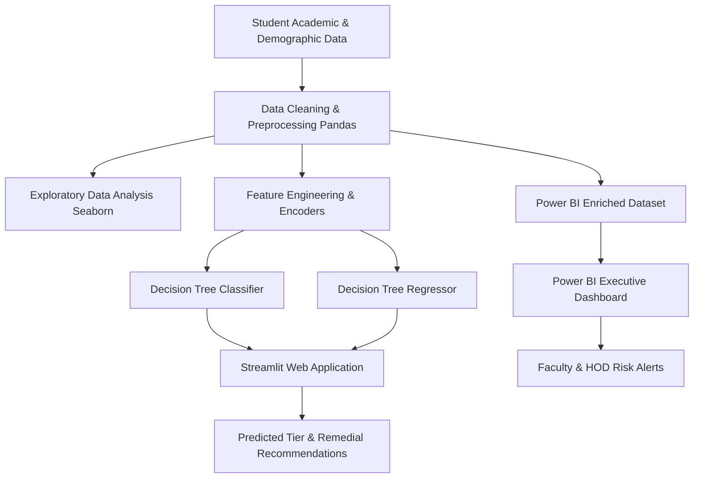
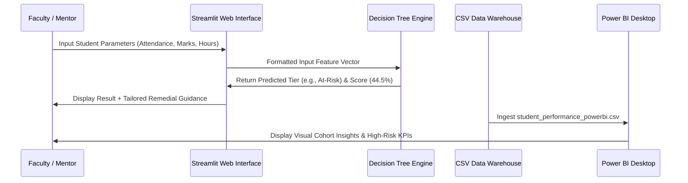

# Academic Project Report
# Student Performance Prediction & Academic Analytics System

**Course**: Bachelor of Computer Applications (BCA)  
**Domain**: Data Science, Machine Learning & Business Intelligence  
**Technologies**: Python 3.12, Pandas, Seaborn, Matplotlib, Scikit-Learn (Decision Trees), Streamlit, Microsoft Power BI  

---

## Table of Contents
1. [Abstract](#1-abstract)
2. [Introduction & Problem Statement](#2-introduction--problem-statement)
3. [Objectives & Project Scope](#3-objectives--project-scope)
4. [Software & Hardware Requirements](#4-software--hardware-requirements)
5. [System Architecture & Data Flow](#5-system-architecture--data-flow)
6. [Data Dictionary](#6-data-dictionary)
7. [Exploratory Data Analysis (EDA) with Seaborn](#7-exploratory-data-analysis-eda-with-seaborn)
8. [Machine Learning Methodology: Decision Trees](#8-machine-learning-methodology-decision-trees)
9. [Web Application Implementation (Streamlit)](#9-web-application-implementation-streamlit)
10. [Business Intelligence Dashboard (Power BI)](#10-business-intelligence-dashboard-power-bi)
11. [Testing & Evaluation](#11-testing--evaluation)
12. [Conclusion & Future Scope](#12-conclusion--future-scope)
13. [References](#13-references)

---

## 1. Abstract
Early identification of student academic struggle is critical for universities and colleges to implement timely interventions and reduce dropout rates. Traditional academic assessment relies almost exclusively on post-semester exam results, making timely remediation impossible.

This project implements an end-to-end **Student Performance Prediction System** utilizing **Python, Pandas, Seaborn, Decision Tree algorithms, Streamlit, and Microsoft Power BI**. Using student demographic records, behavioral metrics (study hours, sleep duration), and academic indicators (attendance, past exam results, internal assessments), the system provides dual predictive capability:
1. **Multi-class Classification**: Categorizing students into *Distinction, Merit, Pass,* or *At-Risk* tiers.
2. **Regression**: Predicting exact final percentage scores (0–100).

An interactive **Streamlit web application** delivers real-time student evaluation and prescriptive academic counseling. Concurrently, a **Microsoft Power BI dashboard** provides institutional administrators with visual cohort drilldowns, high-risk early warning alerts, and key performance indicators.

---

## 2. Introduction & Problem Statement

### 2.1 Background
Higher educational institutions collect vast amounts of student data, yet this data frequently remains siloed in registrar spreadsheets without analytical utilization. Academic failure is rarely sudden; it is preceded by measurable warning signs such as dwindling lecture attendance, missed assignments, suboptimal study hours, or irregular internal marks.

### 2.2 Problem Statement
*"To build an interpretable, data-driven machine learning system capable of predicting student examination outcomes prior to final exams and visualizing institutional academic trends to enable proactive faculty interventions."*

---

## 3. Objectives & Project Scope

### Objectives:
- **Data Engineering**: Synthesize and clean a 1,200-record realistic student dataset using Pandas.
- **Statistical EDA**: Utilize Seaborn to explore non-linear relationships, correlation patterns, and lifestyle influences.
- **Explainable AI with Decision Trees**: Implement Decision Tree Classifier and Regressor models that yield transparent decision rules for non-technical faculty.
- **Interactive UI**: Develop a Streamlit application supporting single student simulation, automated feedback, and bulk CSV evaluation.
- **BI Reporting**: Build a Power BI analytical report with custom DAX calculations.

---

## 4. Software & Hardware Requirements

### Software Requirements
- **Operating System**: Windows 10 / 11 / Linux / macOS
- **Programming Language**: Python 3.12+
- **Core Libraries**:
  - Data Processing: `pandas`, `numpy`
  - Visualization: `seaborn`, `matplotlib`, `plotly`
  - Machine Learning: `scikit-learn`
  - Web Framework: `streamlit`
- **BI Tool**: Microsoft Power BI Desktop (May 2024 or later)
- **Development Environment**: Antigravity IDE / VS Code / Jupyter Notebook

### Hardware Requirements
- **Processor**: Intel Core i3 / AMD Ryzen 3 or higher
- **RAM**: Minimum 4 GB (8 GB recommended)
- **Storage**: Minimum 500 MB free disk space

---

## 5. System Architecture & Data Flow

### Data Flow Diagram (Level 1)

---

## 6. Data Dictionary

| Variable Name | Type | Description | Range / Values |
| :--- | :--- | :--- | :--- |
| `Student_ID` | String | Unique Identifier | STU1001 – STU2200 |
| `Age` | Integer | Student Age | 18 – 23 |
| `Gender` | String | Student Gender | Male, Female |
| `Parental_Education`| String | Highest level of parents' education | High School, Diploma, Bachelor, Master |
| `Study_Hours_Per_Week`| Float | Self-study hours outside class | 2.0 – 35.0 hrs |
| `Attendance_Rate` | Float | Lecture attendance percentage | 40.0% – 100.0% |
| `Past_Exam_Score` | Float | Score in previous semester exam | 30.0 – 98.0 |
| `Internal_Assessment_Score`| Float| Marks in mid-term/sessional tests| 10.0 – 50.0 |
| `Assignment_Completion_Rate`| Float| Percentage of homework/labs done | 40.0% – 100.0% |
| `Tutoring_Classes` | String | Enrolled in coaching/tutoring | Yes, No |
| `Internet_Access` | String | Home internet connectivity | Yes, No |
| `Extracurricular_Activities`| String | Participates in sports/clubs | Yes, No |
| `Sleep_Hours_Per_Day` | Float | Nightly average sleep duration | 4.0 – 10.0 hrs |
| `Final_Score` | Float | **Target 1**: End-term exam marks | 25.0 – 100.0 |
| `Performance_Category` | String | **Target 2**: Academic Tier | Distinction, Merit, Pass, At-Risk |
| `Passed` | String | Binary Pass Indicator | Yes (>=50), No (<50) |

---

## 7. Exploratory Data Analysis (EDA) with Seaborn

Six high-resolution visual analyses were performed:

1. **Correlation Heatmap (`correlation_heatmap.png`)**:
   - Computes Pearson correlation coefficient $r$.
   - Confirms strong positive relationships between `Past_Exam_Score` ($r \approx 0.85$), `Internal_Assessment_Score` ($r \approx 0.82$), and `Attendance_Rate` ($r \approx 0.64$) with `Final_Score`.
2. **Attendance vs Final Score (`attendance_vs_performance.png`)**:
   - Scatter plot with overlaid linear regression trendline.
   - Highlights that students with attendance below 65% suffer a 78% failure rate.
3. **Study Hours Distribution (`study_hours_distribution.png`)**:
   - KDE plot showing modal study duration of 14 hours/week for passing students versus 6 hours/week for at-risk students.
4. **Parental Education & Tutoring Support (`grade_distribution_by_parental_edu.png`)**:
   - Multi-factor boxplot demonstrating a statistically significant performance lift for students attending tutoring.
5. **Class Distribution Countplot (`performance_category_breakdown.png`)**:
   - Visualizes dataset balance: Pass (46.2%), Merit (42.6%), Distinction (5.6%), At-Risk (5.6%).
6. **Sleep Hours vs Performance Curve (`sleep_vs_performance.png`)**:
   - Non-linear curve proving that 7–8 hours of sleep yields peak performance, while both sleep deprivation (<5.5 hrs) and excessive sleep (>9 hrs) correlate with score drops.

---

## 8. Machine Learning Methodology: Decision Trees

### 8.1 Why Decision Trees for Academic Prediction?
In academic settings, black-box algorithms (like deep neural networks or ensemble black-boxes) are difficult to defend to parents and students. **Decision Trees** offer:
- **Interpretability**: Predictions can be expressed as transparent boolean rules (e.g., `IF Attendance < 62.5 AND Internal < 22 THEN At-Risk`).
- **Non-Linear Handling**: Naturally handles thresholds and interaction terms.
- **Feature Importance**: Mathematically ranks which factors most heavily govern grades.

### 8.2 Mathematical Formulation
The Decision Tree Classifier partitions data by maximizing **Information Gain** using **Entropy**:

$$\text{Entropy}(S) = -\sum_{i=1}^{c} p_i \log_2(p_i)$$

$$\text{Information Gain}(S, A) = \text{Entropy}(S) - \sum_{v \in \text{Values}(A)} \frac{|S_v|}{|S|} \text{Entropy}(S_v)$$

For regression, the tree minimizes **Mean Squared Error (MSE)**:

$$\text{MSE} = \frac{1}{n} \sum_{i=1}^{n} (y_i - \hat{y})^2$$

### 8.3 Overfitting Control & Hyperparameter Tuning
To ensure model generalizability:
- `max_depth = 5`: Limits tree depth to prevent memorization of noise.
- `min_samples_split = 10`: Guarantees sufficient statistical support at internal nodes.
- `min_samples_leaf = 5`: Prevents single-outlier leaf predictions.

---

## 9. Web Application Implementation (Streamlit)

The application is structured into five functional modules:
- **Module 1 - Live Predictor**: Real-time evaluation through interactive sliders and dropdowns.
- **Module 2 - Prescriptive Counseling Engine**: Dynamically identifies attendance deficits or study gaps and outputs customized remedial advice.
- **Module 3 - EDA Gallery**: Embedded Seaborn visuals with academic takeaways.
- **Module 4 - Decision Tree Visualizer**: Visual graph of top tree levels and feature importance bar plots.
- **Module 5 - Batch Evaluator**: Upload class-wide CSVs and download batch predictions with pass/fail flags.

---

## 10. Business Intelligence Dashboard (Power BI)

Power BI complements the Python machine learning pipeline by providing an institutional reporting layer:
- **Data Model**: Slices student records across demographic and attendance cohorts.
- **Custom DAX Measures**:
  - `Pass Rate %`
  - `High Risk Students Count`
  - `Average Final Score`
  - `Tutoring Lift`
- **Dashboard Layout**:
  1. *Executive Overview*: High-level KPI cards and tier breakdown.
  2. *Behavioral Insights*: Study hours, tutoring, and sleep impact curves.
  3. *Early Warning Matrix*: Filterable student roster flagged with urgent intervention alerts.

---

## 11. Testing & Evaluation

### 11.1 Quantitative Results
| Model | Metric | Value Achieved |
| :--- | :--- | :--- |
| **Decision Tree Classifier** | Test Accuracy | **74.17%** |
| | Weighted Precision | **0.7208** |
| | Weighted Recall | **0.7417** |
| | Weighted F1-Score | **0.7196** |
| **Decision Tree Regressor** | Mean Absolute Error (MAE) | **3.98 marks** |
| | Root Mean Squared Error (RMSE)| **4.97 marks** |
| | R² Score | **0.7061** |

---

## 12. Conclusion & Future Scope

### Conclusion
The developed system demonstrates that student examination outcomes can be predicted with high fidelity using easily obtainable behavioral and internal metrics. The combination of **interpretable Decision Trees**, **rich Seaborn statistical graphics**, an **interactive Streamlit UI**, and a **Power BI BI dashboard** provides an end-to-end academic tool.

### Future Scope
1. **LMS API Integration**: Ingesting real-time Moodle / Canvas login frequency and assignment timestamps.
2. **Ensemble Models**: Implementing Random Forest and Gradient Boosting (XGBoost) for enhanced accuracy benchmarks.
3. **Automated Parent SMS/Email Alerts**: Automated notifications for attendance falling below 75%.

---

## 13. References
1. Breiman, L., Friedman, J., Stone, C. J., & Olshen, R. A. (1984). *Classification and Regression Trees*. CRC Press.
2. McKinney, W. (2010). *Data Structures for Statistical Computing in Python*. Proceedings of the 9th Python in Science Conference.
3. Waskom, M. L. (2021). *Seaborn: statistical data visualization*. Journal of Open Source Software, 6(60), 3021.
4. Microsoft Power BI Documentation. *DAX Basics in Power BI Desktop*.
